# PRACTICA 2. SISTEMAS DE CONTROL DE VERSIONES. GIT. RAMIFICACIONES


## 1. Crear un repositorio con las ramas de máster y develop

### 1.1. Creamos el repositorio remoto


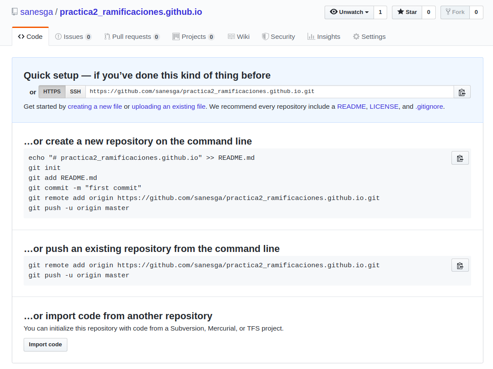


### 1.2 Inicializamos el repositorio con git flow, dejamos los nombres de las ramas por defecto y añadimos un guión para el prefijo del tag.

```
git flow init
```


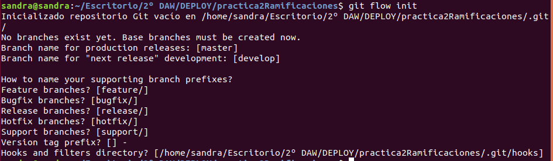


### 1.3. Verificamos la estructura de ramas construida. Comprobamos que se ha creado la rama máster y la rama develop y nos ha posicionado automáticamente en esta última.

```
git branch -a
```


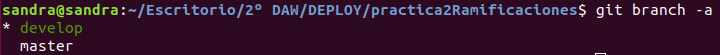


### 1.4. Añadimos dos archivos de código a la carpeta del proyecto (index.html y index.js).

### 1.5. Nos colocamos en la rama máster y añadimos los archivos al repositorio local. Utilizamos git add . porque no queremos ignorar ningún archivo.

```
git checkout master
```
```
git add . 
```
```
git commit -m "Añadido: Código base"
```

### 1.6. A continuación, añadimos el repositorio remoto.

```
git remote add origin https://github.com/sanesga/practica2_ramificaciones.github.io.git
```

### 1.7. Subimos los archivos al repositorio remoto.

```
git push origin master
```


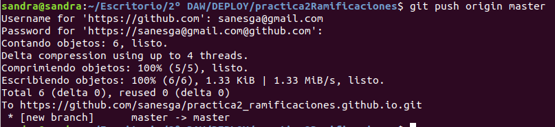


### 1.8. Observamos los archivos añadidos al repositorio remoto, en la rama master.


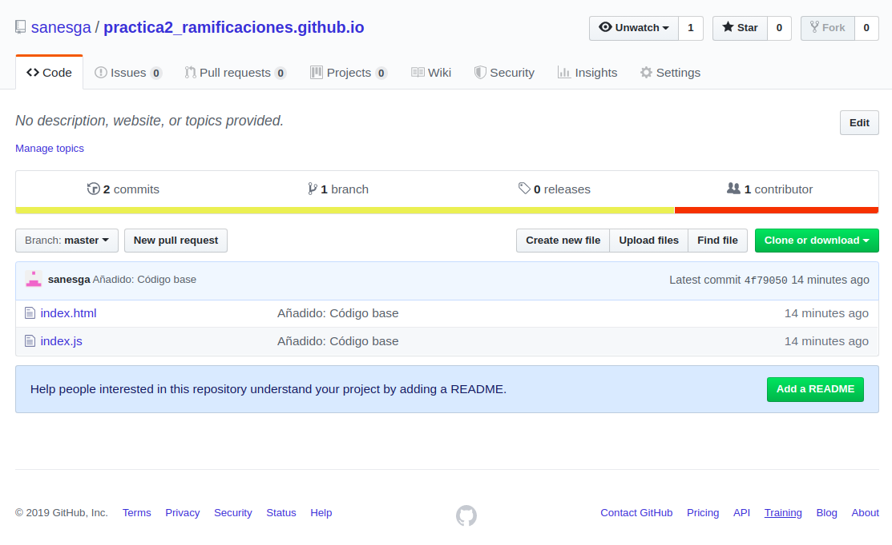


### 1.9. Hacemos lo propio con la rama develop. Hacemos una copia de máster y la subimos al repositorio remoto. 

- Nos colocamos en develop.

  ```
  git checkout develop
  ```

- Hacemos un merge de la rama master a develop

  ```
  git merge master
  ```

  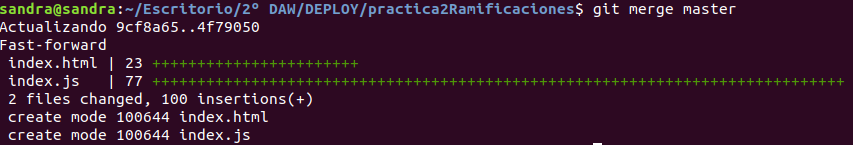


- Subimos la rama develop al repositorio remoto

  ```
  git push origin develop
  ```

  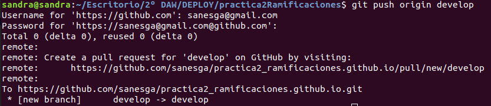


- Observamos la rama develop en el repositorio remoto


  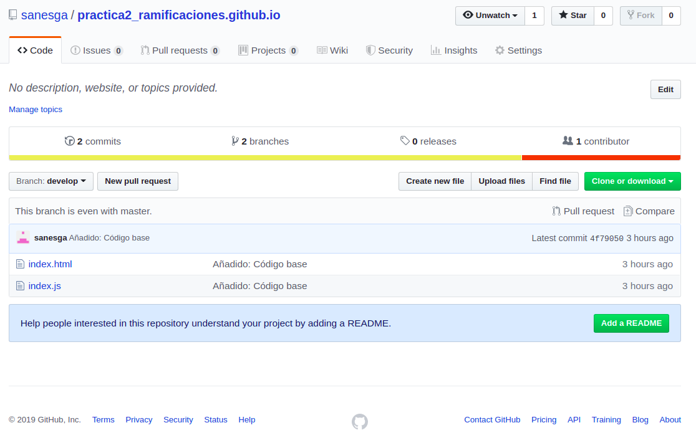


### 1.10. Ya tenemos la rama máster y la rama develop con idéntico contenido tanto en local como en remoto.

  ```
  git branch -a
  ```


  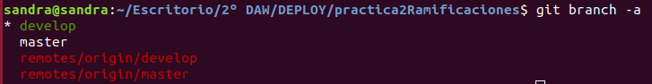


## 2. Generar diferentes features con pequeños cambios en el proyecto. Algunas de las features deben modificar un mismo fichero.

### 2.1. Generamos la Feature 1. Al hacerlo con git flow, nos crea la nueva rama basada en la rama develop y nos coloca el head en ella.

  ```
  git flow feature start feature1
  ```
  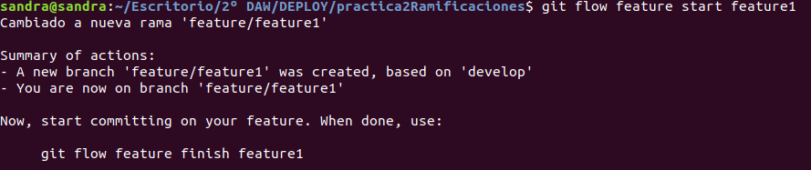

### 2.2. Modificamos el fichero index.html añadiendo la siguiente línea:

\<p>Párrafo añadido en la feature 1\</p>

### 2.3. Añadimos cambios y subimos la rama al repositorio remoto.

  ```
  git add .
  ```
  ```
  git commit -m "Añadido: Nuevo párrafo por feature 1"
  ```
  ```
  git push origin feature/feature1
  ```


  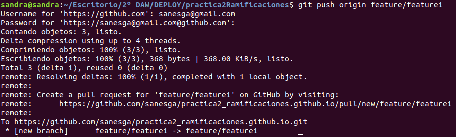


  ### 2.4. Generamos la feature 2. Seguimos los mismos pasos que antes y modificamos el mismo fichero,añadiendo otro párrafo

  -\<p>Párrafo añadido en la feature 2\</p>

  ### 2.5. Generamos la feature 3. En esta, creamos un nuevo fichero de texto.
  
  nuevoFichero.txt

  ### 2.6. Una vez creado todo en local y remoto, verificamos.

  ```
  git branch -a
  ```


  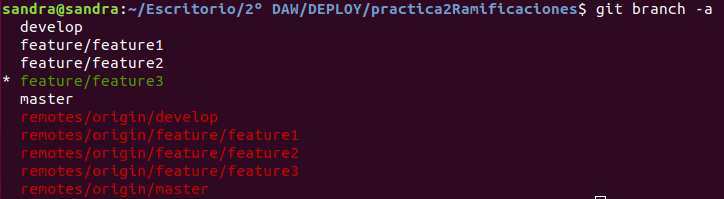


  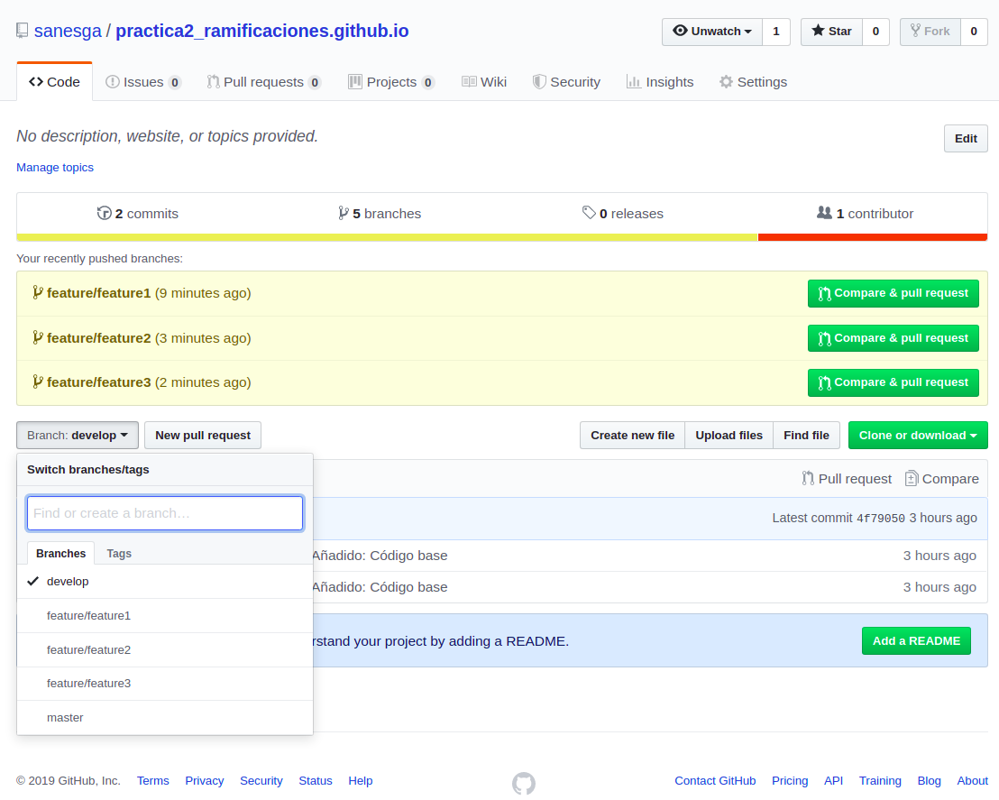


  ### 2.7. Fusionamos las ramas. Las ramas de tipo feature se fusionan únicamente con la rama develop. Procedemos a ello. Utlizaremos el siguiente comando, que fusiona la rama automáticamente y añadimos -k para que no la elimine.

  - Fusionamos feature 1. Se fusiona sin conflictos.

    ```
    git flow feature finish -k feature1
    ```
  - Fusionamos feature 2. Nos informa de un conflicto ya que anteriormente modificamos el mismo archivo que la feature 1.


    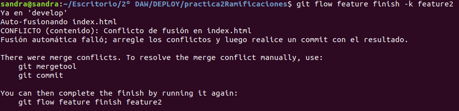


   - Abrimos el archivo index.html. Nos indica los conflictos, elegimos el código manualmente (nos quedamos con las dos líneas) y guardamos.


     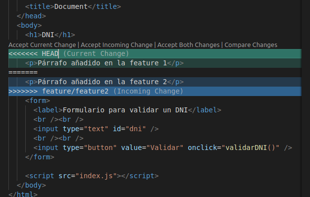

   - Guardamos y subimos cambios

     ```
     git add .
     ```

     ```
     git commit -m "Realizado: Merge con feature2"
     ```

     ```
     git push origin develop
     ```

 - Fusionamos feature 3. Seguimos las directrices anteriores. No da conflictos.


   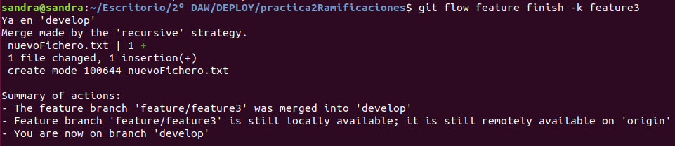


## 3. Crear una nueva release con todas las features creadas. Esta rama también se basa en develop.

  ```
  git flow release start release1
  ```


  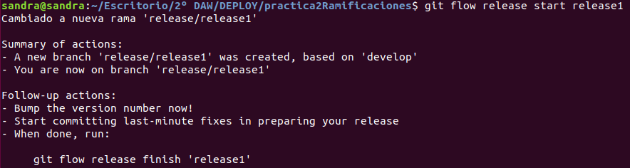


### 3.1 Subimos la rama al repositorio remoto. No es necesario hacer add ni commit porque no hemos hecho cambios.

  ```
  git push origin release/release1 
  ```

  ```
  git branch -a
  ```


  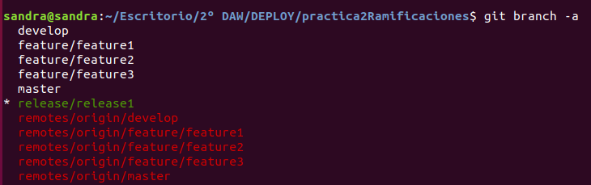


  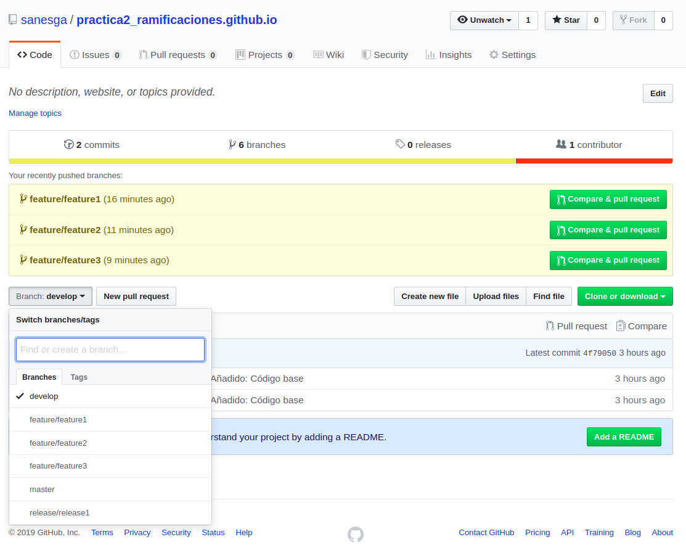


## 4. Simular que se ha detectado un error en la release y solucionarlo.

### 4.1. Creamos un nuevo archivo de texto

  solucionError.txt

### 4.2 Guardamos cambios y subimos a repositorio remoto

  ```
  git add .
  ```

  ```
  git commit -m "Añadido: Solucionado error por release 1"
  ```

  ```
  git push origin release/release1
  ```

## 5. Publicar la release en producción y esta debe quedar etiquetada.

  ```
  git flow release publish release1
  ```
   Nos informa que la rama ya está actualizada y publicada porque en el punto anterior lo hicimos manualmente.

 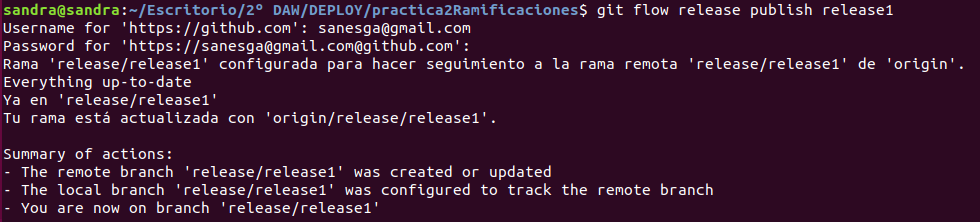

  ```
  git branch -a
  ```

 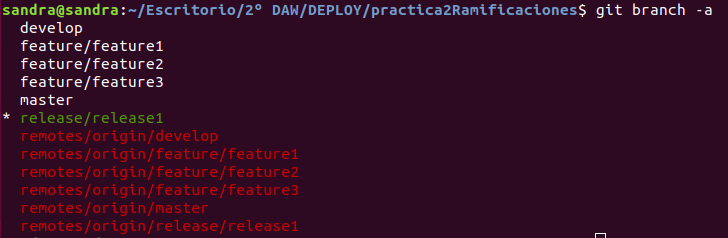


### 5.1. Creamos una etiqueta anotada sobre la rama

  ```
  git tag -a v.1.0 -m "versión 1.0"
  ```

### 5.2. La subimos al repositorio remoto

  ```
  git push origin release/release1 v.1.0 
  ```


 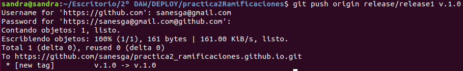


### 5.3. Comprobamos que se ha creado

  ```
  git tag
  ```


 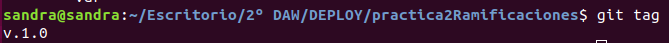


### 5.4. Fusionamos la rama. Las ramas release se fusionan con máster y con develop.

- Nos situamos en máster

  ```
  git checkout master
  ```

- Hacemos merge con release1

  ```
  git merge release/release1 
  ```


  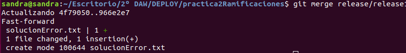


- Subimos los cambios al repositorio remoto

  ```
  git push origin master
  ```

- Observamos en el repositorio remoto que se añade el archivo de texto solucionError.txt en la rama máster.


  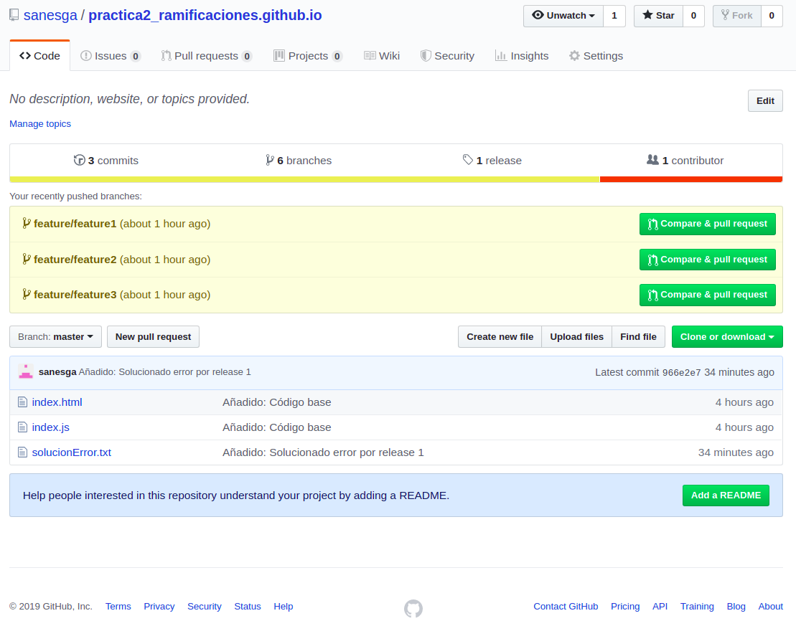


- Seguimos el mismo procedimiento para fusionar release con la rama develop.


  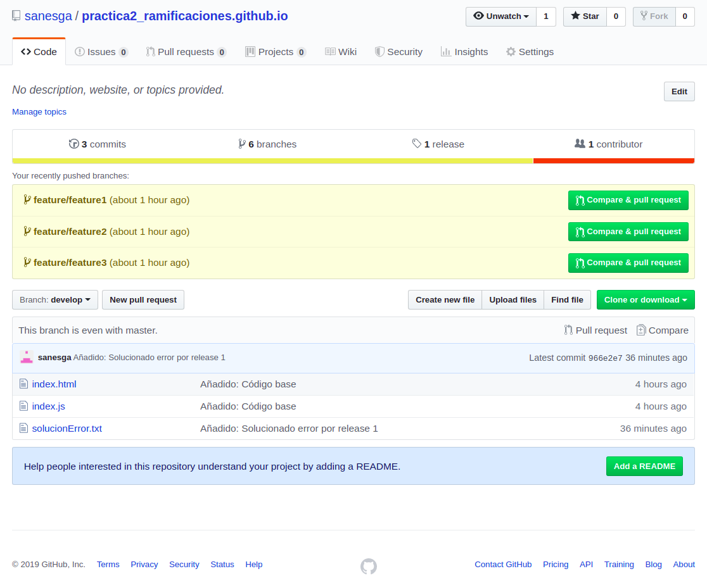


## 6. Simular la existencia de un error en producción y solucionarlo por medio de un hotfix.

### 6.1. Creamos la rama

 ```
 git flow hotfix start hotfix1
 ```


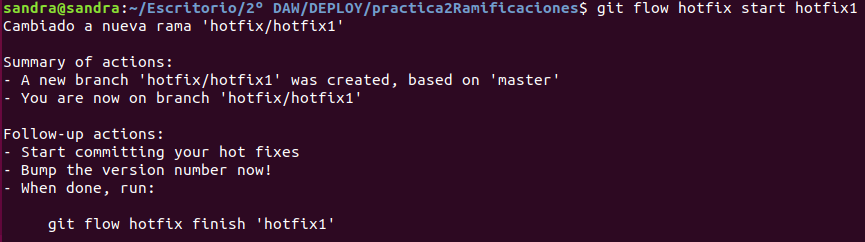


### 6.1. Corregimos un error en el index.html añadiendo esta línea:

\<p>Soluciono error con hotfix\</p>

### 6.2. Subimos la rama y el contenido al repositorio remoto

 ```
 git add .
 ```
 ```
 git commit -m "Solucionado error con hotfix1"
 ```
 ```
 git push origin hotfix/hotfix1 
 ```
 ```
 git branch -a
 ```


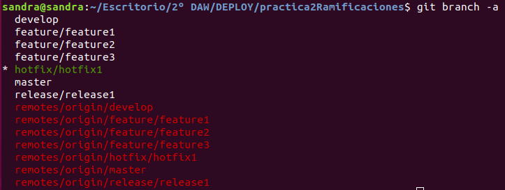


### 6.3. Observamos el contenido de la rama en el repositorio remoto.


### 6.4. La rama hotfix se fusiona con máster y develop. Nos posicionamos en ellas y hacemos merge.

 ```
 git checkout master
 ```

 ```
 git merge hotfix/hotfix1
 ```


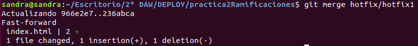


### 6.5. Subimos los cambios de máster al repositorio remoto

 ```
 git push origin master
 ```


 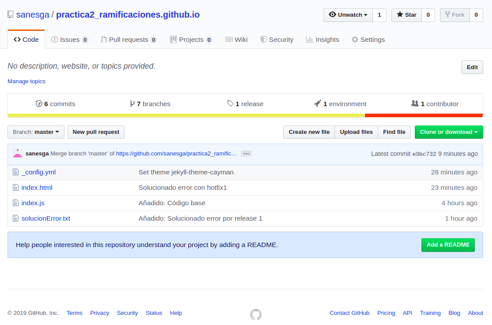


### 6.5. Realizamos los mismos pasos para fusionarla con develop.


# TIP
**Si quisiéramos hacer merge al mismo tiempo que eliminamos cualquiera de las ramas creadas hasta ahora, podemos utilizar este comando**

 ```
 git flow nombreRama finish
 ```

## 7. Documentar el proceso completo en Github Pages o Gitlab Pages.


